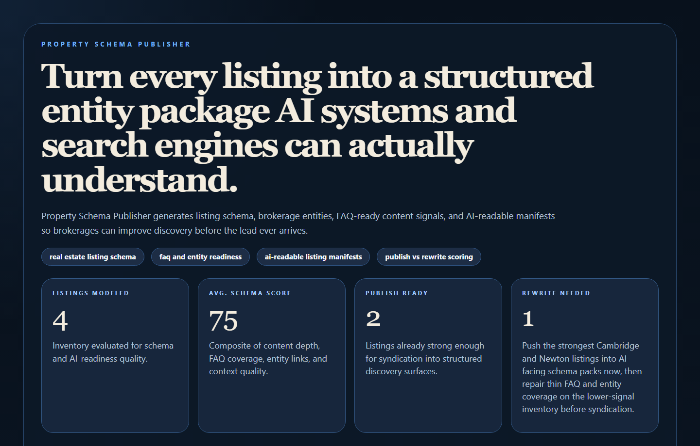
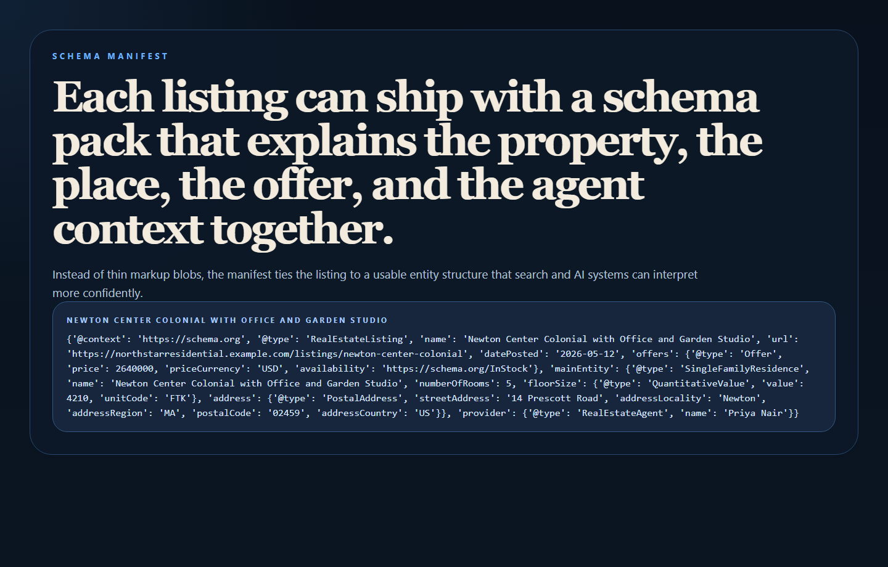
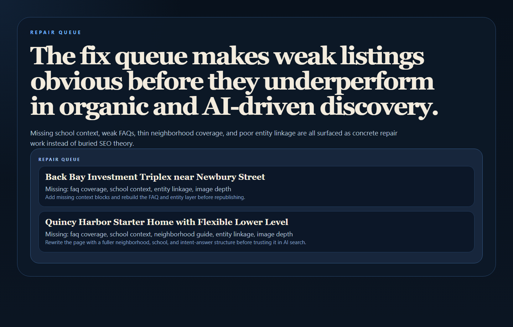
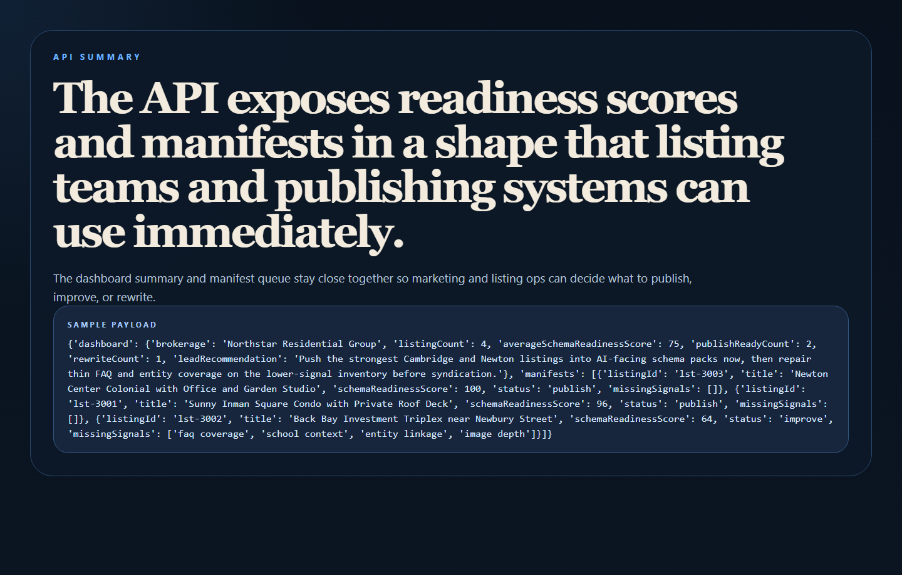

# Property Schema Publisher

Property Schema Publisher is a real estate structured-data and AI-readiness engine for turning property listings into stronger schema packs, listing manifests, and entity-aware content surfaces.



## Why this repo is good

- It targets discovery quality before the lead ever arrives.
- It pairs perfectly with `lead-routing-command-center`, giving you real estate growth plus ops.
- It makes AEO / GEO / SEO work commercially legible for brokerages and listing teams.

## What it does

- Generates `RealEstateListing`, `Offer`, `PostalAddress`, agent, and brokerage schema structures.
- Scores listing pages for FAQ depth, entity linkage, neighborhood context, school context, and content quality.
- Flags which listings are ready to publish, need improvement, or need a full rewrite.
- Exposes an API plus a clean proof dashboard and manifest views.

## Proof





## Local run

```powershell
cd property-schema-publisher
py -3.11 -m venv .venv
.\.venv\Scripts\python.exe -m pip install -r requirements.txt
.\.venv\Scripts\python.exe -m app.main
```

Open:

- `http://127.0.0.1:4784/`
- `http://127.0.0.1:4784/manifest`
- `http://127.0.0.1:4784/fix-queue`
- `http://127.0.0.1:4784/docs`

## Validation

```powershell
.\.venv\Scripts\python.exe -m unittest discover -s tests
.\.venv\Scripts\python.exe scripts\run_demo.py
.\.venv\Scripts\python.exe scripts\smoke_check.py
.\.venv\Scripts\python.exe scripts\render_readme_assets.py
```

## API shape

Endpoints:

- `/api/dashboard/summary`
- `/api/listings`
- `/api/brokerage-schema`
- `/api/listings/{listing_id}`
- `/api/sample`

## Repo layout

```text
app/
  data/
  services/
docs/
scripts/
screenshots/
tests/
```
